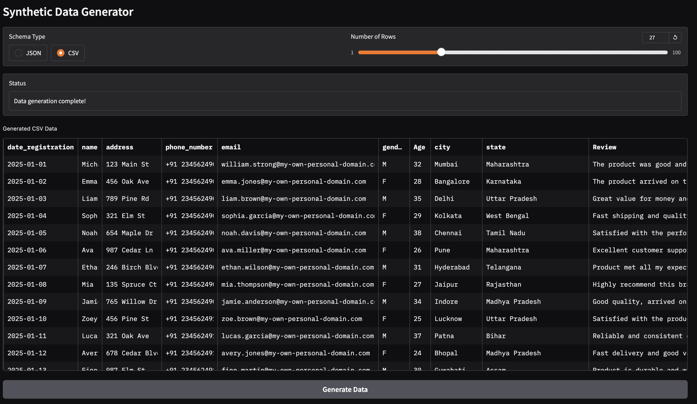

# 🌟 Synthetic Customer Data Generator with Large Language Models 🌟

This notebook demonstrates a powerful and interactive solution for generating high-quality synthetic customer data using various Large Language Models (LLMs) hosted on Hugging Face. The core idea is to leverage the generative capabilities of these models to create realistic, structured data that can be invaluable for testing, development, and data exploration without compromising real customer privacy.

## ✨ Features

*   **Versatile LLM Integration**: Seamlessly integrates with multiple Hugging Face Causal Language Models (e.g., Google Gemma, Microsoft Phi-3, Qwen, Llama 3.1) for diverse data generation capabilities.
*   **Efficient Model Loading**: Utilizes `bitsandbytes` and `accelerate` for efficient 4-bit quantization, enabling the use of larger models even in resource-constrained environments like Colab GPUs (e.g., T4).
*   **Customizable Schema**: Generates data based on a pre-defined, flexible schema that includes various data types such as `TEXT`, `DATE`, `INTEGER`, and `PHONE_NUMBER`, ensuring structured and consistent output.
*   **Dynamic Data Generation**: Allows for on-the-fly specification of the number of rows to generate, providing flexibility for different data volume needs.
*   **Multiple Output Formats**: Supports generation in both **JSON** and **CSV** formats, catering to different data consumption requirements.
*   **Interactive Gradio UI**: Features an intuitive Gradio interface for easy interaction, allowing users to select the desired schema type (JSON/CSV) and number of rows, then instantly view the generated data.
*   **Real-time Feedback**: The Gradio UI provides status updates during data generation, enhancing user experience.
*   **Memory Optimization**: Includes robust memory management techniques (`torch.cuda.empty_cache()`, `gc.collect()`) to prevent out-of-memory errors when switching between models or generating large datasets.

## 🚀 How to Use

1.  **Run All Cells**: Execute all code cells in the notebook sequentially.
2.  **Hugging Face Login**: Ensure your Hugging Face token is set up in Colab secrets (`HF_TOKEN`) and logged in for model access.
3.  **Launch Gradio UI**: Once the Gradio UI cell executes, a local URL and a public share link will be provided. Click the public share link to open the interactive data generator.
4.  **Generate Data**: Select your preferred 'Schema Type' (JSON or CSV) and 'Number of Rows' using the radio buttons and slider, then click 'Generate Data'.
5.  **View Output**: The generated data will appear in the respective output area (JSON in a textbox, CSV in an interactive table).

## 💡 Use Cases

*   **Application Development**: Quickly populate databases or mock APIs with realistic data.
*   **Testing**: Create diverse test datasets for software validation.
*   **Data Analysis & Prototyping**: Experiment with data structures and preliminary analysis without access to sensitive real data.
*   **LLM Experimentation**: Easily compare the data generation capabilities of different LLMs by swapping out the `MODEL` variable.

This notebook provides a complete pipeline from model setup to interactive data generation, making it a valuable tool for anyone needing synthetic customer data.